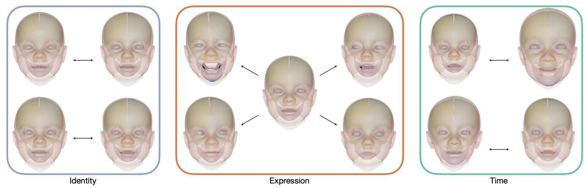
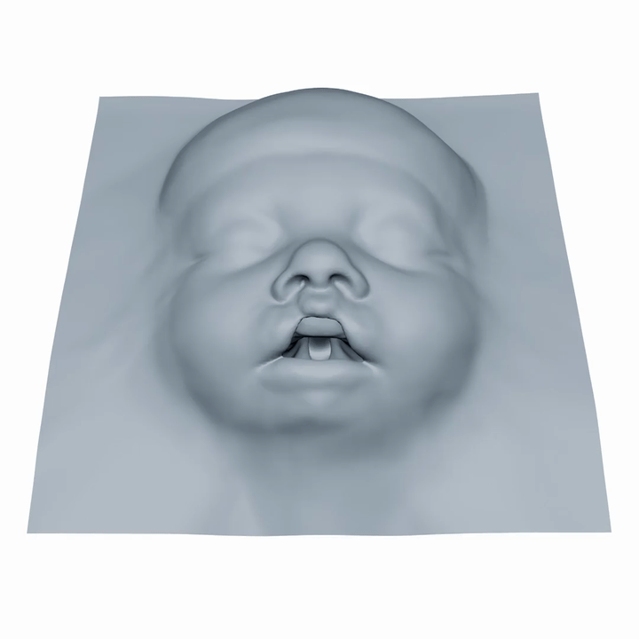
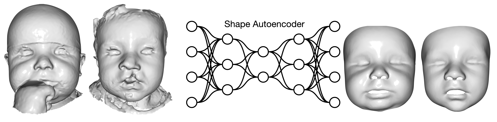
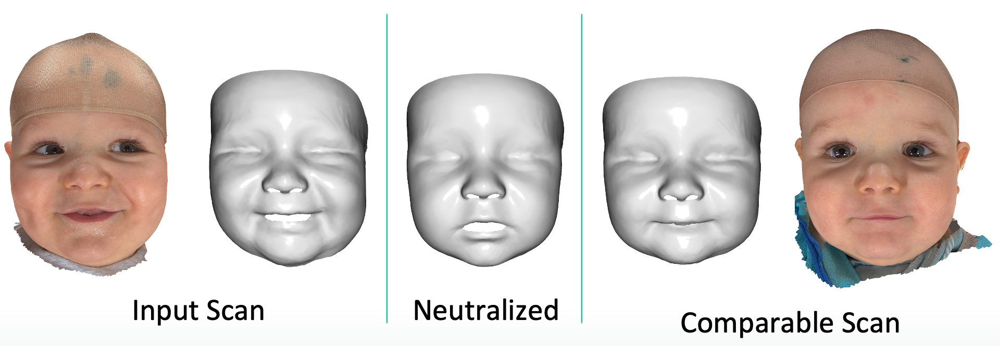
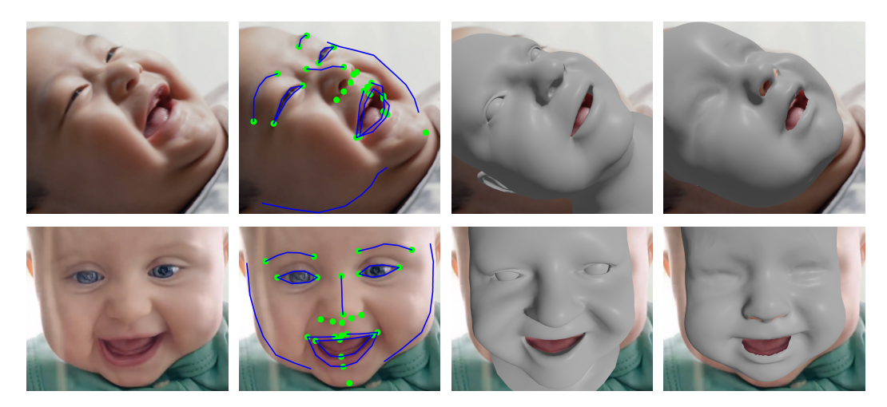
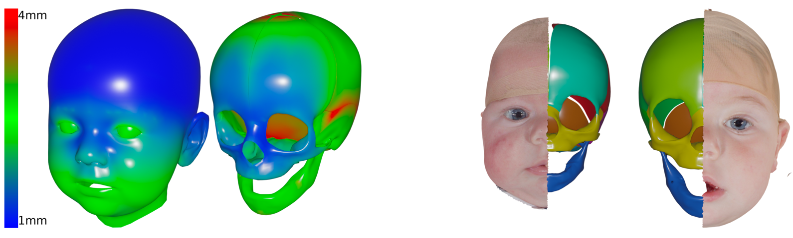
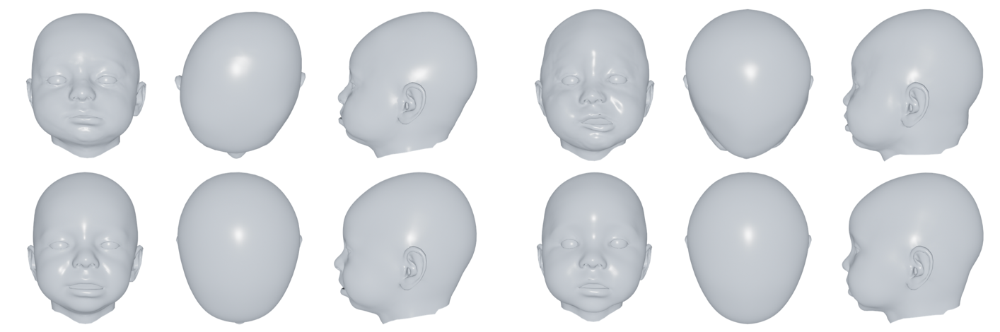
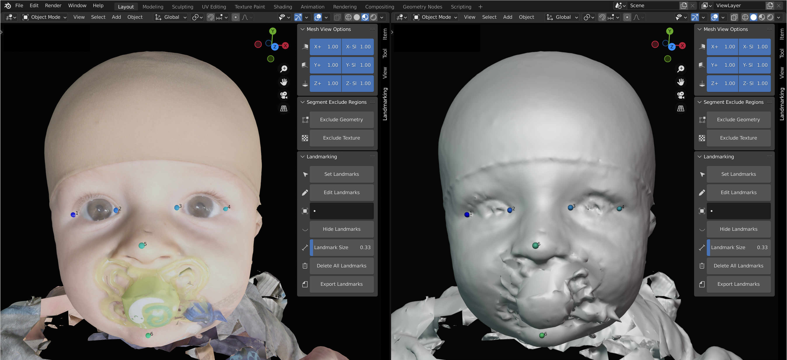

# INFACE, INCRAN, and INCLEFT: Large-Scale 3D Infant Face, Head, Skull, Cleft, Palate Models

Official Python implementation of the [INFACE](https://cgl.ethz.ch/publications/papers/paperSch24a.php), 
[INCRAN](https://cgl.ethz.ch/publications/papers/paperSch25a.php), and 
[INCLEFT]((https://cgl.ethz.ch/publications/papers/paperSch26a.php))
3D infant face/head/skull/palate/cleft morphable and implicit models. 

<p align="center">

</p>

<p align="center">

</p>

<p align="center">

</p>

<p align="center">
  
  
</p>

## Installation

For the explicit morphable models, basic code functionality requires only a minimal python installation, 
using h5py for loading the model parameters and numpy for the computations. Additional libraries:
- For the implicit models from INCLEFT, as well as a label prediction model, 
torch is required (GPU not required, but can speed up some computation) 
and scikit-image for extracting the mesh from the SDF
- Additional visualization and mesh handling capabilities can be enabled via open3d
(if you want to load and save meshes without open3d, 
the mesh class implements some json handling for mesh formatting, but it's limited)
- for registration: scipy, scikit-learn, libigl (not strictly necessary, but can be useful), and scikit-sparse (besides torch)
- for PCA reconstructions, fcpca can also be useful
- for the computation of medically relevant measurements: trimesh and related libraries 
(shapely, mapbox_earcut, rtree, networkx)
- For predicting 3D landmarks and artifacts: robust_laplacian and potpourri3d (besides torch)
- for 3D reconstruction from 2D images: opencv-python, pillow
- joblib can be used for parallel computations (scripts with num_jobs argument require this if you put num_jobs above 1)
- natsort is used to sort files like the os (not required, the order is just sometimes nicer)

Example for complete installation:
```
conda create -n inface python=3.10
conda activate inface
pip install numpy==1.26.4 h5py==3.15.1 open3d==0.16.0 scipy==1.15.3 fbpca==1.0 scikit-image==0.25.2 trimesh==3.20.2 shapely==2.0.6 mapbox_earcut==1.0.2 rtree==1.0.1 networkx==3.0 natsort==8.3.1 joblib==1.2.0 opencv-python==4.7.0.72 pillow==12.0.0 torch==1.13.0 tensorboard==2.11.0 robust_laplacian==1.0.0 potpourri3d==1.3 pyyaml==6.0 libigl==2.4.1 tqdm==4.65.0 scikit-learn==1.3.1
```
You can also try more recent versions for the libraries, but we haven't tested them. 
You can also install torch with CUDA/GPU support (cf. https://pytorch.org/get-started/locally/).

ARM MacBooks might have trouble with open3d 0.16.0. You can just try to use `open3d==0.19.0` instead.

For registering meshes with NICP, you might also want to install pypardiso on Windows, or scikit-sparse on Mac/Linux.
Without that, the code will just run more slowly.

Windows:
```
pip install pypardiso intel-openmp==2021.4.0
```
On Mac/Linux, first install SuiteSparse, then install scikit-sparse (cf. https://github.com/scikit-sparse/scikit-sparse)
```
pip install scikit-sparse==0.4.8
```

## Blender Setup
Feel free to first try the code without this, but as soon as you want to use
the Blender interfaces, come back here and follow these steps. 
For the landmarking tool, you can also refer to 
[`src/blender/README_landmarking.md`](src/blender/README_landmarking.md) instead.
### Downloading Blender
Assuming you've already downloaded this repository, you now need to download 
[Blender](https://www.blender.org). 
Even though we tried to make this code very generic, we cannot guarantee that it will be 
compatible with all future versions of Blender, which is why we recommend 
[Blender 3.1](https://download.blender.org/release/Blender3.1).
Feel free to try other versions; Blender versions in 4 and 5 also seemed to be working in our short tests.
We also recommend changing the following options in Blender (Edit -> Preferences):
1. Interface -> Splash Screen (uncheck)
2. Navigation -> Trackball (choose instead of Turntable) + Orbit Around Selection (check)
3. Input -> Emulate 3 Button Mouse (check)

### Installing Libraries in Blender
We managed to make the landmarking tool and the renderer fully independent of additional libraries not shipped
by Blender by default. However, the interfaces showing cranial attributes and morphable model variations
still require h5py to load the morphable model. The following should hopefully work:
```
/PATH/TO/BLENDERS/PYTHON/EXECUTABLE -m pip install h5py==3.14.0
```
E.g., on MacOS with Blender 3.1, the executable typically has the path
`/Applications/Blender.app/Contents/Resources/3.1/python/bin/python3.10`. On Windows, it might be
`/C/Program\ Files/Blender\ Foundation/Blender\ 3.1/3.1/python/bin/python.exe`. Note that you could 
also install all libraries in Blender and just use that as your virtual environment instead of
the conda environment proposed above. However, we also had some issues with the installation 
in Blender. Sometimes, the packages aren't installed at the correct location, in which case
the flags `--ignore-installed` and `--target` might help.
Alternatively, you can try to copy the packages from your conda environment into the Blender environment:
```
rm -rf PATH/TO/BLENDER/3.1/python/*
rsync -ra PATH/TO/CONDA/envs/inface/ PATH/TO/BLENDER/3.1/python/
```
Pay attention to the python versions, though. Blender 3.1 and the inface conda environment we propose both
use python 3.10, but if you use something different, you need to make sure the python versions match.

### Finding the Blender Executable
This step might not be necessary. Feel free to first try the code and only come back to this one
if you get an ImportError about setting the executable in a config file.
If you want to start Blender from this repo, but you have your Blender in an abnormal location,
you might need to specify the location of the Blender executable. 
For that, check where you downloaded Blender to
your system, look inside the folder and locate the executable file. Copy the path to that executable.
Now go to [`config.py`](config.py) and replace the None value of `blender_executable` on line 11 with your path.
E.g., on a Mac, the line could look like this:
`blender_executable: Union[str, None] = "/Applications/Blender.app/Contents/MacOS/Blender"`.


## Download Models

For INCLEFT and INCRAN, we provide the shape models without and with disentanglement 
of expression and age/time variation, as described in the papers. 
Additionally, we provide the linear regressors described in the INCRAN paper.
Due to privacy concerns, we currently do not provide the appearance models described in the INFACE paper.
For INCLEFT, we provide several implicit models, trained with different settings on the full dataset 
or some more complete subsets. We also include a baseline explicit PCA morphable model trained on all data, 
but without accounting for missing values. Additionally, even though we cannot publish the actual data-based latent
codes, we also include PCA directions of the implicit models' latent codes that were optimized on the dataset during
training. This adds a bit more interpretability to the implicit models, since the first components still encode
the largest variation of the dataset.
Moreover, we provide access to three [DiffusionNet](https://github.com/nmwsharp/diffusion-net)-based
models that we trained to automatically detect keypoints and artifacts in healthy infant faces 
(without clefts or palates). This is not part of a publication, but it can be used to register and analyze
new baby face/head scans fully automatically by first detecting keypoints and artifacts, 
and then registering one of the provided shape models to the scans. 
With that, subsequent cranial measurements and adjustments can be automatically computed, the mesh can also
be normalized to the unit cube and reconstructed with the implicit model. Expressions can be changed, skull
inferred, etc.

Please contact [Till Schnabel](mailto:till@familie-schnabel.ch) or [Barbara Solenthaler](mailto:solenthaler@inf.ethz.ch) 
to get access to the model parameters or 
if you have any questions about the code or related to the papers.
Access is only provided to academic researchers. Usage of the models is restricted solely to research purposes.

The files are ordered as follows:
- The folder [`models/INFACE`](models/INFACE) contains the models used for and described in the INFACE paper:
    - [`models/INFACE/pca_model.h5`](models/INFACE/pca_model.h5): PCA infant face model without disentanglement
    - [`models/INFACE/ae_model.h5`](models/INFACE/ae_model.h5): Autoencoder infant face model without disentanglement
    - [`models/INFACE/ae_model_disent.h5`](models/INFACE/ae_disent_model.h5): Autoencoder infant face model 
with disentanglement of identity (0-32), expression (32-96), and age (96-97)
- The folder [`models/INCRAN`](models/INCRAN) contains the models and linear regressors used for and described in the INCRAN paper:
    - [`models/INCRAN/pca_head_model.h5`](models/INCRAN/pca_head_model.h5): PCA model of the outer infant head without disentanglement
    - [`models/INCRAN/pca_skull_model.h5`](models/INCRAN/pca_skull_model.h5): PCA model of the infant skull without disentanglement
    - [`models/INCRAN/ae_disent_model_reprojected.h5`](models/INCRAN/ae_disent_model_reprojected.h5) 
Autoencoder infant head model with disentanglement of identity (0-8), 
expression (8-40), and time (40-56). Unlike in INFACE, this is a linear autoencoder that was reprojected into PCA space 
post-training, so that the latent space is more interpretable (orthogonal and sorted by variance). 
We do not have a disentangled model of the skull, but we have regressors translating the space of this disentangled 
head autoencoder to the normal skull PCA model, cf. below.
    - [`models/INCRAN/pca_regressor_head_to_skull.json`](models/INCRAN/regressor_pca_head_model_to_pca_skull_model.json): 
Linear regressor that translates from the space of pca_head_model.h5 to 
pca_skull_model.h5 (json file that contains factor (matrix) and intercept (vector)).
    - [`models/INCRAN/pca_regressor_skull_to_head.json`](models/INCRAN/regressor_pca_skull_model_to_pca_head_model.json): 
Linear regressor that translates from the space of pca_skull_model.h5 to 
pca_head_model.h5 (json file that contains factor (matrix) and intercept (vector)).
    - [`models/INCRAN/ae_disent_head_to_skull.json`](models/INCRAN/regressor_ae_disent_model_reprojected_to_pca_skull_model.json): 
Linear regressor that translates from the space of ae_disent_model_reprojected.h5 to 
pca_skull_model.h5 (json file that contains factor (matrix) and intercept (vector)).
    - [`models/INCRAN/ae_disent_skull_to_head.json`](models/INCRAN/regressor_pca_skull_model_to_ae_disent_model_reprojected.json): 
Linear regressor that translates from the space of pca_skull_model.h5 to 
ae_disent_model_reprojected.h5 (json file that contains factor (matrix) and intercept (vector)).
    - [`models/INCRAN/pca_head_attribute_correlation.json`](models/INCRAN/pca_head_attribute_correlation.json): 
Linear regressors trained on pca_head_model.h5 to estimate the medically relevant measurements 
discussed in the paper. Each entry has the measurement name as key, and as entries the regressor weight (vector) and 
intercept/data mean (scalar), as well as the standard deviation, and a description of that measurement.
    - [`models/INCRAN/pca_head_attribute_correlation_nonlinear_mapping.json`](models/INCRAN/pca_head_attribute_correlation_nonlinear_mapping.json):
Also trained on pca_head_model.h5, but it includes an experimental nonlinear mapping 
for age and the cranial volumes and circumference. We haven't thoroughly experimented with it, though. 
Each entry has the measurement name as key, and as entries the regressor weight (vector),  
intercept/data mean (scalar), the standard deviation, a description of that measurement, and then four
more entries in case a nonlinear mapping was applied.
    - [`models/INCRAN/ae_disent_attribute_correlation.json`](models/INCRAN/ae_disent_attribute_correlation.json): 
Linear regressors trained on ae_disent_model_reprojected.h5 to estimate the medically relevant measurements 
discussed in the paper. Each entry has the measurement name as key, and as entries the regressor weight (vector) and 
intercept/data mean (scalar), as well as the standard deviation, and a description of that measurement. 
- The folder [`models/INCLEFT`](models/INCLEFT) contains the models used for and described in the INCLEFT paper:
  - [`models/INCLEFT/implicit_full_no-sdfcorrection.pt`](models/INCLEFT/implicit_full_no-sdfcorrection.pt): 
Implicit model trained on all face and palate scans 
without the SDF correction term (correspondences fully constrained, potentially lower fidelity)
  - [`models/INCLEFT/implicit_full_sdfcorrection.pt`](models/INCLEFT/implicit_full_sdfcorrection.pt): 
  Implicit model trained on all face and palate scans 
with the SDF correction term (correspondences less constrained, potentially higher fidelity)
  - [`models/INCLEFT/implicit_onlyfaces_sdfcorrection.pt`](models/INCLEFT/implicit_onlyfaces_sdfcorrection.pt):
Implicit model trained only on face scans, so no palate scans, with SDF correction.
  - [`models/INCLEFT/implicit_onlyhealthyfaces_sdfcorrection.pt`](models/INCLEFT/implicit_onlyhealthyfaces_sdfcorrection.pt): 
Implicit model trained only on healthy face scans, 
so no palate scans and no face scans with cleft, with SDF correction.
  - [`models/INCLEFT/implicit_onlypaired_sdfcorrection.pt`](models/INCLEFT/implicit_onlypaired_sdfcorrection.pt): 
Implicit model trained only on the paired face and palate scans, with SDF correction. 
Note that this data subset only included 74 paired scans, from which the face scans did not include the cranium 
and were taken under sedation, so the model even though the model has learned a proper 
connection between face, nose, lip, and palate, it doesn't know facial expressions, the full cranium, 
and some other variations.
  - [`models/INCLEFT/implicit_onlypalates_sdfcorrection.pt`](models/INCLEFT/implicit_onlypalates_sdfcorrection.pt): 
Implicit model trained only on palate scans, with SDF correction. 
The dataset included 176 palate scans, which, unlike in the other models, where the palate only fills a small 
portion of the unit cube, were normed to fill the unit cube, disregarding the face.
  - [`models/INCLEFT/explicit_full_pca.h5`](models/INCLEFT/explicit_full_pca.h5): 
Baseline explicit 3D morphable model, using PCA. 
The mesh template used for registration can be extracted from this model.
  - [`models/INCLEFT/pca_attribute_correlation.json`](models/INCLEFT/pca_attribute_correlation.json): 
Linear regressors trained on explicit_full_pca.h5 to estimate the medically relevant measurements 
discussed in the INCRAN paper and additional measurements for the cleft as discussed in the INCLEFT paper. 
Each entry has the measurement name as key, and as entries the regressor weight (vector) and 
intercept/data mean (scalar), as well as the standard deviation, and a description of that measurement. 
Note that the model's linearity unfortunately cannot make the cleft-correlated measurements work optimally,
so for a patient with a cleft, adjusting the respective correlated measurement vector to 0 within the model space
doesn't always yield the desired cleft fusion. We offer a possible solution with the nonlinear mapping file described
just below, but we haven't thoroughly experimented with this.
  - [`models/INCLEFT/pca_attribute_correlation_nonlinear_mapping.json`](models/INCLEFT/pca_attribute_correlation_nonlinear_mapping.json): 
Similar to the above attribute correlation file, but with nonlinear mappings for cranial volumes and circumference, 
age, and cleft directions. Each entry has the measurement name as key, and as entries the regressor weight (vector),  
intercept/data mean (scalar), the standard deviation, a description of that measurement, and then four
more entries in case a nonlinear mapping was applied.
- [`models/diffusion-net/healthy_faces_label_prediction`](models/diffusion-net/healthy_faces_label_prediction): 
This folder includes the DiffusionNet-based model checkpoints that can
be used to predict labels (landmarks and segmentation of artifacts) on raw healthy face scans of infants. 
You don't need to load them individually. Rather, they're all loaded together to make the full label prediction, 
cf. descriptions further below.
  - [`models/diffusion-net/healthy_faces_label_prediction/artifact_seg.pt`](models/diffusion-net/healthy_faces_label_prediction/artifact_seg.pt): 
This checkpoint is used to predict artifact segmentations.
  - [`models/diffusion-net/healthy_faces_label_prediction/pass1.pt`](models/diffusion-net/healthy_faces_label_prediction/pass1.pt): 
This checkpoint is used to predict a first set of keypoints, which are used to align and rescale the raw input scan.
  - [`models/diffusion-net/healthy_faces_label_prediction/pass2.pt`](models/diffusion-net/healthy_faces_label_prediction/pass2.pt): 
This checkpoint is used to predict the same set of keypoints as in pass1, but with increased 
precision, given the alignment of pass1.
  - [`models/diffusion-net/healthy_faces_label_prediction/reference_landmarks.csv`](models/diffusion-net/healthy_faces_label_prediction/reference_landmarks.csv): 
Landmarks used to align the scan to after pass1. 


## Code Usage

### File Structure

#### Top Folders
- [`src`](src) folder: contains all code
- [`models`](models) folder: contains trained models (cf. above)
- [`registration_configs`](registration_configs) folder: contains sample configuration files for running the registration
- [`deepsdf_configs`](deepsdf_configs) folder: contains sample configuration files for training the implicit model 
(the file names are analogous to the model files in the [`models/INCLEFT`](models/INCLEFT) folder).
- [`sample_expressions`](sample_expressions) folder: contains files with sample expressions that can be 
used with the disentangled INFACE model.
- [`config.py`](config.py): Blender path needs to be added to this file to a variable called `blender_executable`. 
E.g., on Mac: `blender_executable = "/Applications/Blender.app/Contents/MacOS/Blender"`.
Without this, blender interaction might not work.

#### Code Structure
- [`src/blender`](src/blender)  folder: contains blender scripts, utils, and a python interface to call 
blender with the correct script from python. For the Blender interaction to work, please add a config.py file to the top
folder of this project, and add the absolute path to the blender executable to it.
  - [`src/blender/blender_utils.py`](src/blender/blender_utils.py): 
Common blender methods used by several scripts (not well documented)
  - [`src/blender/python_interface.py`](src/blender/python_interface.py): 
Basically calls Blender, adding the respective script and associated 
arguments. Again, please define the variable `blender_executable` within a config.py on the top folder 
level of this project. You can check out the functions defined within this script. They allow you to open the 
different Blender interfaces, defined with the other scripts detailed below, directly from python. 
E.g., `set_landmarks()` opens the Blender landmarking tool.
  - [`src/blender/landmarking.py`](src/blender/landmarking.py): A well-developed blender script to add custom 
landmarks and artifact segmentations to an input mesh. 
Please refer to [`src/blender/README_landmarking.md`](src/blender/README_landmarking.md) for more information.
  - [`src/blender/measurement_correction_GUI.py`](src/blender/measurement_correction_GUI.py): 
GUI that shows the different cranial measurements we correlated with the 
INCRAN models, including sliders to adjust a registered or the average mesh along these measurements.
  - [`src/blender/morphable_model_visualizer.py`](src/blender/morphable_model_visualizer.py): 
Basic slider interface to visualize the component variations of 
the explicit models (implicit models are not supported here). The visualizer also accepts more than one morphable 
model if you provide also the json that translates from the first morphable model to the additional ones. 
The visualizer also includes options to make separate mesh components transparent, e.g., 
to make the head transparent, such that the underlying skull is also visible. 
  - [`src/blender/renderer.py`](src/blender/renderer.py): Very basic script to render one or m
ultiple images with Blender from python (can be run headless, i.e., render images without opening the Blender GUI).
- [`src/objects`](src/objects) folder: Contains important classes, including mesh class, morphable model class, 
implicit model class, and more.
  - [`src/objects/mesh.py`](src/objects/mesh.py): We provide a basic mesh class that stores vertices, triangles as numpy arrays, 
can load meshes from and save them to disk, and visualize them using Open3D's visualizer. 
It also includes more optional attributes, such as vertex colors, textures, and landmarks.
It also includes some processing methods, some of which use Open3D or trimesh, but a few are also self-implemented.
The file also includes a Landmarks and a CurvilinearFeatures class, objects of which can be attributes of a Mesh object.
The Landmarks class has a numpy 2D/3D point array as main attribute, but it may also include names and confidence values
for each point. Processing methods include getting specific points, adding/removing points, reordering, and also an
alignment method, also used from the mesh class to rigidly align one mesh to another over its landmarks via Procrustes 
analysis. The CurvilinearFeatures class is similar to the Landmarks class, but it contains a list of numpy arrays of 
2D/3D points and some functions to process a raw array of 3D points into such an order. For now, it doesn't include 
names or confidence values.
  - [`src/objects/morphable_model.py`](src/objects/morphable_model.py): 
The MorphableModel class is an abstract class that implements 
a morphbable model visualizer (based on open3D), (partial) model-based mesh reconstruction, 
model sampling, and parameter loading from HDF5 files. The PCA and AE class inherit from this class. 
The file offers a main method that can be easily called with arguments from the terminal to visualize a PCA or 
autoencoder morphable model, cf. further below. A MorphableModel object can be used either with numpy or with torch.
E.g., if you only want to sample a mesh, numpy is sufficient, but for optimizing a latent code during
registration or 3D reconstruction from 2D, torch can be used.
  - [`src/objects/AE_morphable_model.py`](src/objects/AE_morphable_model.py): 
Specific class for autoencoder. Implements encode and decode 
function. Accepts both, the normal and the disentangled version. The disentangled version further offers methods 
for adjusting the expression and age of a mesh, as well as transferring the expression from a source to a target mesh.
The file can be run as script for basic visualization -- note that the visualization of the face autoencoder 
without disentanglement is not very interesting, since the latent space is 
neither orthogonal nor ordered; in the disentangled version, the slider components are automatically chosen to cover
parts of the identity, expression, and age space. The disentangled head autoencoder was additionally 
projected back into PCA space, thus adding further interpretability, cf. further below.
  - [`src/objects/PCA_morphable_model.py`](src/objects/PCA_morphable_model.py): 
Specific class for PCA model. Implements encode and decode function. 
Can also be run as script for basic visualization. It also includes a train() function to train
a new PCA morphable model on registered meshes 
(train via CLI using [`src/processing/train_pca_model.py`](src/processing/train_pca_model.py).
  - [`src/objects/linear_regressor.py`](src/objects/linear_regressor.py): Minimal class for loading a 
linear regressor that is used to translate between the latent codes of two morphable models.
  - [`src/objects/cranial_attributes.py`](src/objects/cranial_attributes.py):
Includes the method for computing all the measurements 
we used in the INCRAN paper, as well as the methods for loading and using measurement-specific linear 
regressors to adjust the model space, yielding craniums adjusted for the respective measurements. 
The file can be run as a script to sample a meshes with a provided model and adjust them based on the 
attributes we correlated.
  - [`src/objects/implicit_model.py`](src/objects/implicit_model.py): 
Although there's a bit of overlap, we defined the implicit model as a separate
class that does not inherit from morphable model. It requires torch and includes the IMFACE-based model formulation. 
It offers an encode method that iteratively finds the best latent fitting to the input. It also includes the decode 
function to go from latent to a mesh (reconstructed from the SDF via marching cube).
  - [`src/objects/indices_and_masks.py`](src/objects/indices_and_masks.py): 
Contains a static class used to handle index and mask arrays, including loading and saving functions, 
converting one to the other, joining, intersecting, subtracting different indices and/or masks.
  - [`src/objects/visualizer.py`](src/objects/visualizer.py): 
Open3D-based visualizer that includes a few additional options:
One can toggle meshes on and off with the number keys. One can also switch between other meshes via the arrow keys.
One can switch between texture mode, vertex color mode, and no color mode via "C". There's also an implementation
of a visualization thread, which can be called with any method and run in parallel while showing mesh updates from 
that method. This is useful, for instance, in the registration, where the deformation updates can be interactively 
visualized.
  - [`src/objects/registration_file_communicator.py`](src/objects/registration_file_communicator.py): 
This file simply handles the communication with files for the registration, specifically used by 
[`src/processing/registration.py`](src/processing/registration.py) (cf. further below), but also by some 
other files that want to access registration files. 
- [`src/processing`](src/processing) folder: Contains scripts to process raw data, 
comprising a script used to label a whole dataset with landmarks and artifact segmentations, 
another script to automatically predict such labels, 
a script to compute 3D reconstruction from 2D images, 
and finally a torch-based registration script.
  - [`src/processing/landmarking_batch.py`](src/processing/landmarking_batch.py): 
Call this with a dataset as argument. It will loop over the meshes 
and open the Blender landmarking tool for each to set new or correct given landmarks and artifact segmentations.
  - [`src/processing/predict_3d_labels.py`](src/processing/predict_3d_labels.py): 
Predict a pre-defined set of landmarks and segmentations of artifacts 
on raw scans of healthy infant faces (no cleft faces, no palates, no skulls (for now)). This file uses additional 
code from the files located in [`src/processing/diffusion_net`](src/processing/diffusion_net), adapted from 
[DiffusionNet](https://github.com/nmwsharp/diffusion-net). The predicted labels can optionally also be corrected
with the landmarking tool, if required.
  - [`src/processing/shape_reconstruction_from_monocular_images.py`](src/processing/shape_reconstruction_from_monocular_images.py): 
Basic torch optimization fitting the latent 
code of a morphable model to 2D landmarks detected in an infant face image (no cleft, no palate, no skull). This file
uses additional code from the files located in [`src/processing/infanface_lm_detector`](src/processing/infanface_lm_detector), 
adapted from
[InfAnFace](https://github.com/ostadabbas/Infant-Facial-Landmark-Detection-and-Tracking), to predict the 2D landmarks.
  - [`src/processing/registration.py`](src/processing/registration.py): 
3D surface registration using torch. It can just optimize the explicit model 
parameters to fit a (preferably labeled) 3D scan, but it can also go out of model space (based on FLAME) or
it can use [NICP](https://github.com/menpo/menpo3d/blob/master/menpo3d/correspond/nicp.py).
  - [`src/processing/train_deepsdf.py`](src/processing/train_deepsdf.py):
This file can be used to train a new implicit model. Note that we do not provide the dataset. Cf. further below under
[`src/utils_deepsdf`](src/utils_deepsdf.py) for a description how to set it up. Sample configuration files are provided
in the [`deepsdf_configs`](deepsdf_configs) folder.
  - [`src/processing/train_pca_model.py`](src/processing/train_pca_model.py):
Very basic script that basically just calls the train() method from the PCAMorphableModel class and 
passes it the CLI arguments. Useful if you want to train a PCA model from the command line.
- [`src/sample_scripts`](src/sample_scripts) folder: Includes sample scripts that demonstrate different code usages.
- [`src/utils.py`](src/utils.py): Contains supporting classes (Plane and Line) and functions.
- [`src/utils_deepsdf`](src/utils_deepsdf.py): Contains further supporting functions for implicit model. 
This includes also the loss function and dataset class used for training the model. We do not provide the dataset.
If you want to train your own model with this code, you can use the 
[`src/processing/train_deepsdf.py`](src/processing/train_deepsdf.py) file, but you need to set up your own dataset
that includes the input meshes, registered meshes, and flipped versions. More details are provided in the SDFDataset 
class documentation.

Next, we provide some basic usages of the code. Refer to the docs in the respective files for more details.
Also check out the [`src/sample_scripts`](src/sample_scripts) folder for more detailed example usage.

### Basic Visualization

Explicit models can be visualized via:
```
python -m src.objects.morphable_model --path_to_hdf5_file INFACE/pca_model.h5
python -m src.objects.morphable_model --path_to_hdf5_file INCRAN/pca_head_model.h5
python -m src.objects.morphable_model --path_to_hdf5_file INCLEFT/explicit_full_pca.h5
```
You can also visualize multiple correlated morphable models via
```
python -m src.objects.morphable_model --path_to_hdf5_file INCRAN/pca_head_model.h5 --path_to_linear_regressor INCRAN/regressor_pca_head_model_to_pca_skull_model.json --path_to_other_hdf5_file INCRAN/pca_skull_model.h5
```
The default visualizer uses Open3D. You can choose the alternative Blender visualizer by adding `--visualize_with_blender`, e.g.,
```
python -m src.objects.morphable_model --path_to_hdf5_file INCRAN/pca_head_model.h5 --path_to_linear_regressor INCRAN/regressor_pca_head_model_to_pca_skull_model.json --path_to_other_hdf5_file INCRAN/pca_skull_model.h5 --visualize_with_blender
```
We especially recommend the Blender option for the option above, since the head can be made transparent in Blender to 
make the skull better visible.

Note that the visualizer only works with the explicit models. The implicit models cannot be interactively visualized.
What you can do is reconstruct mesh, decode meshes from a latent, or sample meshes, and then visualize these meshes. 
For that, our custom Mesh class also offers visualization of a single mesh:
```
my_mesh = Mesh(vertex_np_array, triangle_np_array)
my_mesh.show()
```
or multiple meshes
```
Mesh.show_multiple_meshes(first_mesh, second_mesh, ...)
```
You can toggle visibility of individual meshes with your num keys. This facilitates comparisons for example between 
input meshes and model reconstructions. You can also pass meshes via the `switch_meshes` argument, so that you
can switch between them with the arrow keys. 
Check out [`src/sample_scripts/show_meshes.py`](src/sample_scripts/show_meshes.py) for more details.
Our visualizer also offers a visualization_thread that allows for visualizations that support interactive mesh
produced by some function running in parallel. 
Check out [`src/sample_scripts/visualization_thread.py`](src/sample_scripts/visualization_thread.py) for a demo.

Other methods can be used with the help of these Mesh and MorphableModel classes:

### Mesh Sampling
Random infant meshes can be generated with our models, e.g.:
```
model = MorphableModel.load_correct_morphable_model("/PATH/TO/YOUR/MODEL.h5")
rand_face_meshes = model.sample_meshes(5)
for num_mesh, mesh in enumerate(rand_face_meshes):
    mesh.export(f"/PATH/TO/SAVE/MESH{num_mesh}.ply")
```
Check out [`src/sample_scripts/sample_meshes.py`](src/sample_scripts/sample_meshes.py) for more details, 
including also implicit model mesh sampling.

### (Partial) Model-Based Mesh Reconstruction

For example, a mesh file can be loaded along with the mask of unknown vertices, then reconstructed via the 
morphable model, then the reconstructed mesh can be visualized and saved.
The argument back_match_known_vertices can be optionally set to True to have the known vertices match exactly the input.
```
mesh = Mesh.load("/PATH/TO/SOME/MESH/FILE.ply")
unknown_vertex_mask = IndicesAndMasks.load("/PATH/TO/UNKNOWN/VERTEX/MASK.txt")
model = MorphableModel.load_correct_morphable_model("/PATH/TO/YOUR/MODEL.h5")
reconstructed_mesh = model.reconstruct_mesh(mesh, unknown_vertex_mask=unknown_vertex_mask, back_match_known_vertices=True)
reconstructed_mesh.show_multiple_meshes(mesh, reconstructed_mesh)
reconstructed_mesh.export("/PATH/TO/SAVE/MESH.ply")
```
Like this, a partial reconstruction of the face or other regions 
such as the one presented in our face paper can be achieved:
<p align="center">

</p>

Check out [`src/sample_scripts/mesh_reconstruction_explicit.py`](src/sample_scripts/mesh_reconstruction_explicit.py) and 
[`src/sample_scripts/mesh_reconstruction_implicit.py`](src/sample_scripts/mesh_reconstruction_implicit.py) 
for more details on model-based mesh reconstruction
with explicit and implicit models.

### Expression Neutralization

Facial expressions can be neutralized for example like this:
```
mesh = Mesh.load("/PATH/TO/SOME/MESH/FILE.ply")
disentangled_model = AEMorphableModel("/PATH/TO/ae_disentangled_model.h5")
mesh_exp_neutralized = disentangled_model.set_expression(mesh, disentangled_model.latent_mean)
mesh_exp_neutralized.show()
mesh_exp_neutralized.export("/PATH/TO/SAVE/MESH.ply")
```
We showed an example for that in our paper:
<p align="center">

</p>

Also check out [`src/sample_scripts/adjust_facial_expression.py`](src/sample_scripts/adjust_facial_expression.py) for more details.

### Expression Transfer

Expressions can also be transferred from one sample to another.
In the folder "sampled_expressions", we provide four randomly sampled latent expression codes similar to the expressions
we used in the video (the actual codes we cannot share due to privacy concerns, because they are based on 
actual patient data, cf. section Dataset below). 
After clustering our dataset by expression codes, we found that these four expressions
already cover a large part of the expression variation over the whole dataset. The expressions can be transferred 
to randomly sampled faces and ages can be fixed to plus and minus two standard deviations.
We provide details in [`src/sample_scripts/interpolate_facial_expressions.py`](src/sample_scripts/interpolate_facial_expressions.py) 
to generate results similar 
to the expression video at the top.

### 3D reconstruction from Monocular Images
We also offer a rather hard-coded implementation to reconstruct
the 3D infant face from a monocular image. Example usage:
```
python -m src.processing.shape_reconstruction_from_monocular_images --model_path INFACE/pca_model.h5 --image_dir /PATH/TO/IMAGE/FOLDER --output_dir /PATH/TO/SAVE/OUTPUTS
```
For detecting landmarks in the 2D images, we use 
[InfAnFace](https://github.com/ostadabbas/Infant-Facial-Landmark-Detection-and-Tracking).
You need to download their [checkpoints](https://drive.google.com/drive/u/0/folders/1sSBXbRmYWVQ3cOF-qNN7aSWRE_L02EYh) 
and put them into the [`models`](models) folder at the top level.
With this, we were able to produce the results shown in the paper:
<p align="center">

</p>
Note that this is a very basic approach for 3D reconstruction from 2D images, since it only matches the landmarks.
More sophisticated approaches usually take colors into consideration, including lighting effects.


### Face and Skull Inference

One can infer skull from head like this:
```
first_model = MorphableModel.load_correct_morphable_model("INCRAN/pca_head_model.h5")
second_model = MorphableModel.load_correct_morphable_model("INCRAN/pca_skull_model.h5")
linear_regressor = LinearRegressor.from_json("INCRAN/regressor_pca_head_model_to_pca_skull_model.json")
mesh = Mesh.load("/PATH/TO/SOME/REGISTERED/MESH/FOR/FIRST/MODEL.ply")
inferred_mesh = first_model.convert_mesh_with_linear_regressor(linear_regressor, mesh, second_model)
```
or vice versa just swap first and second model. 
Check out [`src/sample_scripts/face_skull_inference.py`](src/sample_scripts/face_skull_inference.py) for more details.


This is how we predicted the skulls and faces in our INCRAN paper:
<p align="center">

</p>


### Cranial Attribute Correlation and Correction
Cranial attributes can be corrected for random model samples like this:
```
python -m src.objects.cranial_attributes --path_to_hdf5_file INCRAN/pca_head_model.h5 --path_to_correlated_attributes INCRAN/pca_head_attribute_correlation.json --input_files_or_dirs /PATH/TO/REGISTERED/MESH/OR/FOLDER
```
This saves the measurements computed for the registered mesh, and it
automatically corrects all cranial attributes while fixing age and total volume.
We also offer a sample script under [`src/sample_scripts/cranial_adjustments.py`](src/sample_scripts/cranial_adjustments.py)

The cranial attributes can be visualized, adjusted, and set to optimal values via our Blender GUI:
```
/PATH/TO/BLENDER/EXECUTABLE --python /PATH/TO/INFACE/src/blender/measurement_correction_GUI.py -- --head_model INCRAN/pca_head_model.h5 --head_shape_factor_function INCRAN/pca_head_attribute_correlation.json  --registered_mesh_path /PATH/TO/REGISTERED/MESH.ply 
```
(the last argument is optional).

With this method, we were able to produce the corrections shown in this Figure from the INCRAN paper:
<p align="center">

</p>

Note that we only did this for the head space, not for the skull space, since the dataset of outer head meshes 
is considerably larger. But the corresponding skull can again be inferred with the respective linear regressor, 
as described further above.

Note also that we also include correlated attributes of the cleft for the explicit INCLEFT model,
but the model's linearity unfortunately cannot make the cleft-correlated measurements work optimally,
so for a patient with a cleft, adjusting the respective correlated measurement vector to 0 within the model space
doesn't always yield the desired cleft fusion.

Since nonlinearity can also be a problem for some other attributes, we added an experimental setting
that first maps some attributes into another space via a nonlinear transformation, e.g., 
cubic roots for volumes, square root for head circumference, and a piecewise linear function for age.
We included an additional shape factor function for this. 
Note that we haven't thoroughly experimented with this setting, though.
If you want to train your own functions with this nonlinear mapping, use the `--use_nonlinear_mappings` argument. 
More details are provided in the documentation of the `CranialAttributes` class within 
the [`src/objects/cranial_attributes.py`](src/objects/cranial_attributes.py) file. 

### Visualize Cleft Variations
With our implicit models, we showed that we can vary the cleft fusion in model reconstructions (cf. videos at the top).
A minimal example for this would look like so:
```
model = ImplicitShapeModel.load_static("INCLEFT/implicit_onlypalates_sdfcorrection.pt")
average_mesh = model.decode(model.latent_mean, highlight_correspondences=True)
cleft_mesh = model.decode(model.adjust_latent_along_attribute("w_lip_cleft_left", attribute_extent=0.05, fix_other_attributes=True), highlight_correspondences=True)
Mesh.show_multiple_meshes(average_mesh, cleft_mesh)
```
Also check out [`src/sample_scripts/visualize_cleft_variation.py`](src/sample_scripts/visualize_cleft_variation.py) for more details.

### Registration
A lot of the above methods require meshes to be in dense correspondence. Specifically, every method involving 
a mesh being processed by any explicit model requires a registered mesh. We provide a thorough registration 
pipeline that can be used to register any of our explicit models to raw input scans. Basic registration usage:
```
python -m src.processing.registration --config head_registration_nicp-refine.yaml --input_file_or_dir /INPUT/PATH --output_dir /OUTPUT/PATH
```
The config specifies which model to use, which landmarks to use, and the constraint weights per iteration. 
Further arguments are explained if you add `--help` as argument.
Note that we offer three modes for registration:
1) Model-based registration: optimize model parameters to fit the target.
2) Going out of model space: optimize the vertices of a template, initialized from and regularized by the model 
(adopted from [FLAME](https://flame.is.tue.mpg.de))
3) NICP: Optimize the vertices of a template, initialized from the model, regularized through a stiffness constraint 
(cf. [NICP](https://github.com/menpo/menpo3d/blob/master/menpo3d/correspond/nicp.py)))

These modes can be combined, e.g., first model-based registration, then going out of model space, or refining via NICP.
We provide several example configurations in the [`registration_configs`](registration_configs). 
You can register a single mesh file or all mesh files in a folder. 
Also add `--help` for more details about the registration arguments.
Note that the registration will probably not work well without you providing landmarks. 
The morphable models hae a lot of landmark vertex indices specified, which you can access via
```
morphable_model.get_indices()
```
However, for an arbitrary input scan, you may need to define corresponding landmarks.
We also offer 3D landmark prediction under certain conditions. Both, manual landmarking and 3D prediction
are described next.

### Landmarking
<p align="center">

</p>

We offer a sophisticated landmarking tool in Blender under [`src/blender/landmarking.py`](src/blender/landmarking.py).
You can open Blender directly and pass it the landmarking tool via:
```
/PATH/TO/BLENDER/EXECUTABLE --python /PATH/TO/INFACE/src/blender/landmarking.py -- --mesh_paths /PATH/TO/MESH
```
and use `--help` for more details about the arguments.

If you want to landmark a whole dataset, one mesh after another, you can use the landmarking_batch script:
```
python -m src.processing.landmarking_batch --dataset_folders /PATH/TO/ONE/OR/MORE/DATASET/FOLDERS
```
You can specify a creator name via `--creator` and filter the meshes you want to landmark with a lot of different 
options. Add `--help` to see all arguments. We also offer a separate readme under 
[`src/blender/README_landmarking.md`](src/blender/README_landmarking.md) with more details.

We trained some [DiffusionNet](https://github.com/nmwsharp/diffusion-net)-based models to predict a set of 14
pre-defined landmarks on healthy infant faces. The model checkpoints are included in the same package as the 
shape model parameters. You can predict these landmarks like so:
```
python -m src.processing.predict_3d_labels --input_file_or_dir /PATH/TO/MESH/OR/DATASET
```
For each mesh, a landmark file named like the mesh, ending with `_model.csv` is saved, and an additional file
ending with `_exclude.txt`, which is a segmentation of potential artifacts in the scan. For faces, you can 
use these labels as they are, or you can manually adjust them via 
```
python -m src.processing.landmarking_batch --dataset_folders /SAME/PATH/AS/ABOVE --init_creators model
```

You can then use these labels during registration. However, this only works for faces and only with this scheme.
For any other scheme and any other input type (e.g., skulls, cleft faces, palates), you still need to do the labeling
manually.

### Automated Pipeline for Babies with Healthy Faces
Here, we summarize how baby scans with healthy faces can be processed fully automatically to enable downstream 
applications by combining the steps described before. Assume our input 
1) Predict labels:
```
python -m src.processing.predict_3d_labels --input_file_or_dir /PATH/TO/MESH/OR/DATASET
```
2) (Optional) Correct labels manually
```
python -m src.processing.landmarking_batch --dataset_folders /PATH/TO/MESH/OR/DATASET --init_creators model
```
3) Register mesh (you can choose different config files here)
```
python -m src.processing.registration --config head_registration_nicp-refine.yaml --input_file_or_dir /PATH/TO/MESH/OR/DATASET --output_dir /REGISTRATION/OUTPUT/PATH
```
You will have the aligned and registered meshes saved under `/REGISTRATION/OUTPUT/PATH`.
Downstream applications:
1) Reconstruct mesh and remove artifacts (cf. python code above)
2) Compute cranial measurements and compute optimum:
```
python -m src.objects.cranial_attributes --path_to_hdf5_file /PATH/TO/YOUR/MODEL/FROM/CONFIG.h5 --path_to_correlated_attributes /PATH/TO/YOUR/MODEL/FROM/CONFIG/CORRELATED/ATTRIBUTES.json --input_files_or_dirs /REGISTRATION/OUTPUT/PATH
```
3) Visualize Cranial Measurements on a specific registered mesh:
```
/PATH/TO/BLENDER/EXECUTABLE --python /PATH/TO/INFACE/src/blender/measurement_correction_GUI.py -- --head_model /PATH/TO/YOUR/MODEL/FROM/CONFIG.h5 --head_shape_factor_function /PATH/TO/YOUR/MODEL/FROM/CONFIG/CORRELATED/ATTRIBUTES.json  --registered_mesh_path /REGISTRATION/OUTPUT/PATH/MESH/FILE.ply 
```
4) Neutralize Expression (assuming you've used a disentangled model, cf. python code above)
5) Infer Skull (cf. python code above)


## Dataset
Due to privacy concerns, we cannot share the datasets our models were trained on. 
Please contact [Barbara Solenthaler](mailto:solenthaler@inf.ethz.ch) if you're from an academic institution and
you're interested in setting up a data sharing agreement.

## References
When using this code or the provided models, please either cite our INFACE paper
```
@InProceedings{10.1007/978-3-031-72384-1_21,
author="Schnabel, Till N. and Lill, Yoriko and Benitez, Benito K. and Nalabothu, Prasad and Metzler, Philipp and Mueller, 
Andreas A. and Gross, Markus and G{\"o}zc{\"u}, Baran and Solenthaler, Barbara",
title="Large-Scale 3D Infant Face Model",
booktitle="Medical Image Computing and Computer Assisted Intervention -- MICCAI 2024",
year="2024",
publisher="Springer Nature Switzerland",
address="Cham",
pages="217--227",
isbn="978-3-031-72384-1",
doi="10.1007/978-3-031-72384-1_21"
}
```
and/or our INCRAN paper
```
@InProceedings{SchTil_MultiLinear_MICCAI2025,
author="Schnabel, Till N. and Lill, Yoriko and Benitez, Benito K. and Krief, Gaspard and Tapia Cor{\'o}n, Sebasti{\'a}n 
and Pr{\"u}fer, Friederike and Metzler, Philipp and Mueller, Andreas A. and Gross, Markus and Solenthaler, Barbara",
title="Multi-linear 3D Craniofacial Infant Shape Model",
booktitle="Medical Image Computing and Computer Assisted Intervention -- MICCAI 2025",
year="2025",
publisher="Springer Nature Switzerland",
address="Cham",
pages="338--348",
volume="LNCS 15969",
month="09",
isbn="978-3-032-05127-1",
doi="10.1007/978-3-032-05127-1_33"
}
```
and/or our INCLEFT paper
```
@inproceedings{
schnabel2026an,
title={An Implicit 3D Face and Palate Shape Model for Infant Orofacial Clefts},
author={Till N. Schnabel and Yoriko Lill and Maximilian Weiherer and Ruben Schenk and Vennilah Jeyalingam and Iris Nava Martinez and Benito K. Benitez and Marilyn Keller and Andreas Albert Mueller and Barbara Solenthaler},
booktitle={Workshop on Shape in Medical Imaging at MICCAI 2026},
year={2026},
url={https://openreview.net/forum?id=WBzTjiWVT5}
}
```


