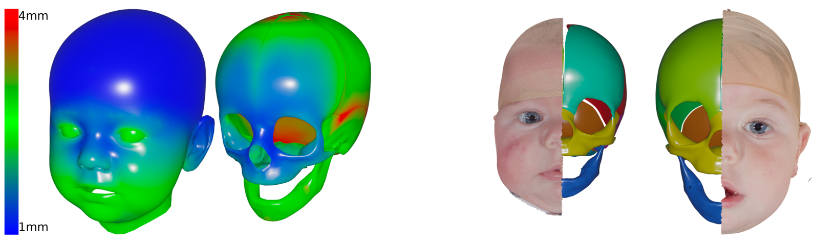

# INFACE and INCRAN: Large-Scale 3D Infant Face, Head, and Skull Models

Official Python implementation of the [INFACE](https://cgl.ethz.ch/publications/papers/paperSch24a.php) 
and [INCRAN](https://cgl.ethz.ch/publications/papers/paperSch25a.php)
3D infant face model. 

<p align="center">

</p>

<p align="center">

</p>

<p align="center">

</p>

## Installation

Basic code functionality requires only a minimal python installation, using h5py for loading the model parameters
and numpy for the computations. Additional visualization and mesh handling capabilities can be enabled via open3d
(if you want to load and save meshes without open3d, the mesh class implements some json handling for mesh formatting), 
and for some advanced reconstruction methods of unknown regions, scipy, fbpca, and scikit-sparse,
and for the computation of medically relevant measurements trimesh, shapely, and mapbox_earcut

Example for complete installation:
```
conda create -n inface python=3.10
conda activate inface
pip install numpy==1.23.5 h5py==3.14.0 open3d==0.16.0 scipy==1.10.0 fbpca==1.0 scikit-sparse==0.4.6 trimesh==3.16.0 shapely==2.0.7 mapbox_earcut==1.0.3
```

## Download Models

We provide the shape models without and with disentanglement of expression and age/time variation, 
as described in the papers. Additionally, we provide the linear regressors described in the INCRAN paper.
Due to privacy concerns, we currently do not provide the appearance models described in the INFACE paper.

Please contact [Till Schnabel](till.schnabel@inf.ethz.ch) to get access to the model parameters or 
if you have any questions about the code or related to the papers.
Access is only provided to academic researchers. Usage of the models is restricted solely to research purposes.

The files are ordered as follows:
- The folder **INFACE** contains the models used for and described in the INFACE paper:
    - **pca_model.h5**: PCA infant face model without disentanglement
    - **ae_model.h5**: Autoencoder infant face model without disentanglement
    - **ae_model_disent.h5**: Autoencoder infant face model with disentanglement of identity (0-32), expression (32-96), and age (96-97)
- The folder **INCRAN** contains the models and linear regressors used for and described in the INCRAN paper:
    - **pca_head_model.h5**: PCA model of the outer infant head without disentanglement
    - **pca_skull_model.h5**: PCA model of the infant skull without disentanglement
    - **ae_disent_model_reprojected.h5** Autoencoder infant head model with disentanglement of identity (0-8), 
expression (8-40), and time (40-56). Unlike in INFACE, this is a linear autoencoder that was reprojected into PCA space 
post-training, so that the the latent space is more interpretable (orthogonal and sorted by variance). 
We do not have a disentangled model of the skull, but we have regressors translating the space of this disentangled 
head autoencoder to the normal skull PCA model, cf. below.
    - **pca_regressor_head_to_skull.json**: Linear regressor that translates from the space of pca_head_model.h5 to 
pca_skull_model.h5 (json file that contains factor (matrix) and intercept (vector)).
    - **pca_regressor_skull_to_head.json**: Linear regressor that translates from the space of pca_skull_model.h5 to 
pca_head_model.h5 (json file that contains factor (matrix) and intercept (vector)).
    - **ae_disent_head_to_skull.json**: Linear regressor that translates from the space of ae_disent_model_reprojected.h5 to 
pca_skull_model.h5 (json file that contains factor (matrix) and intercept (vector)).
    - **ae_disent_skull_to_head.json**: Linear regressor that translates from the space of pca_skull_model.h5 to 
ae_disent_model_reprojected.h5 (json file that contains factor (matrix) and intercept (vector)).
    - **pca_head_attribute_correlation.json**: Linear regressors trained on pca_head_model.h5 to estimate the medically relevant measurements 
discussed in the paper. Each entry has the measurement name as key, and as entries the regressor weight (vector) and 
intercept/data mean (scalar), as well as the standard deviation, and a description of that measurement.
    - **ae_disent_attribute_correlation.json**: Linear regressors trained on ae_disent_model_reprojected.h5 to estimate the medically relevant measurements 
discussed in the paper. Each entry has the measurement name as key, and as entries the regressor weight (vector) and 
intercept/data mean (scalar), as well as the standard deviation, and a description of that measurement. 


## Code Usage

### Code Structure

- **mesh.py**: We provide a basic mesh class that stores vertices and triangles as numpy arrays, 
can load meshes from and save them to disk, and visualize them using Open3D's visualizer. 
Some additional processing methods are also provided. 
- **morphable_model.py**: The MorphableModel class is an abstract class that implements a morphbable model visualizer 
(based on open3D), (partial) model-based mesh reconstruction, model sampling, and parameter loading from HDF5 files. 
The PCA and AE class inherit from this class. The file offers a main method that can be easily called with 
arguments from the terminal to visualize a PCA or autoencoder morphable model, cf. further below.
- **AE_morphable_model.py**: Specific class for autoencoder. Implements encode and decode function via numpy (not torch).
Accepts both, the normal and the disentangled version. The disentangled version further offers methods 
for adjusting the expression and age of a mesh, as well as transferring the expression from a source to a target mesh.
The file can be run as script for basic visualization -- note that the visualization of the face autoencoder 
without disentanglement is not very interesting, since the latent space is 
neither orthogonal nor ordered; in the disentangled version, the slider components are automatically chosen to cover
parts of the identity, expression, and age space. The disentangled head autoencoder was additionally 
projected back into PCA space, thus adding further interpretability, cf. further below.
- **PCA_morphable_model.py**: Specific class for PCA model. Implements encode and decode function also via numpy.
Can also be run as script for basic visualization.
- **linear_regressor.py**: Minimal class for loading a linear regressor that is used to translate between the latent codes
of two morphable models.
- **cranial_attributes.py**: Includes the method for computing all the measurements we used in the INCRAN paper, 
as well as the methods for loading and using measurement-specific linear regressors to adjust the model space, 
yielding craniums adjusted for the respective measurements. The file can be run as a script to sample a meshes 
with a provided model and adjust them based on the attributes we correlated.
- **utils.py**: Contains supporting classes (Plane and Line) and functions.

Next, we provide some basic usages of the code. Refer to the docs in morphable_model.py for all details. 

### Basic Visualization

The PCA model can be visualized via
```
python PCA_morphable_model.py --path_to_hdf5_file /PATH/TO/pca_model.h5
```

The autoencoder models can be visualized via
```
python AE_morphable_model.py --path_to_hdf5_file /PATH/TO/ae_model.h5
python AE_morphable_model.py --path_to_hdf5_file /PATH/TO/ae_disent_model.h5
```

Joint models can be visualized via
```
python morphable_model.py --path_to_hdf5_file /PATH/TO/ae_disent_model.h5 --path_to_linear_regressor /PATH/TO/regressor.json --path_to_other_hdf5_file /PATH/TO/other_model.h5
```

Our custom Mesh class also offers visualization of a single mesh:
```
my_mesh = Mesh(vertex_np_array, triangle_np_array)
my_mesh.show()
```
or multiple meshes
```
Mesh.show_multiple_meshes(first_mesh, second_mesh, ...)
```
You can toggle visibility of individual meshes with your num keys. This facilitates comparisons for example between 
input meshes and model reconstructions.

Other methods can be used with the help of these Mesh and MorphableModel classes:

### (Partial) Model-Based Mesh Reconstruction

For example, a mesh file can be loaded along with the mask of unknown vertices, then reconstructed via the 
morphable model, then the reconstructed mesh can be visualized and saved. 
The argument back_match_known_vertices can be optionally set to True to have the known vertices match exactly the input.
```
mesh = Mesh.load("/PATH/TO/SOME/MESH/FILE.ply")
unknown_vertex_mask = np.load("/PATH/TO/UNKNOWN/VERTEX/MASK.npy")
model = MorphableModel.load_correct_morphable_model("/PATH/TO/YOUR/MODEL.h5")
reconstructed_mesh = model.reconstruct_mesh(mesh, unknown_vertex_mask=unknown_vertex_mask, back_match_known_vertices=True)
reconstructed_mesh.show_multiple_meshes(mesh, reconstructed_mesh)
reconstructed_mesh.export("/PATH/TO/SAVE/MESH.ply")
```
Like this, a partial reconstruction of the face or other regions 
such as the one presented in our face paper can be achieved:
<p align="center">

</p>

### Expression Neutralization

Facial expressions can be neutralized for example like this:
```
mesh = Mesh.load("/PATH/TO/SOME/MESH/FILE.ply")
disentangled_model = AEMorphableModel("/PATH/TO/ae_disentangled_model.h5")
mesh_exp_neutralized = disentangled_model.set_expression(mesh, disentangled_model.latent_mean)
mesh_exp_neutralized.show()
mesh_exp_neutralized.export("/PATH/TO/SAVE/MESH.ply")
```
We showed an example for that in our paper:
<p align="center">

</p>

### Mesh Sampling
Random infant meshes can be generated with our models, e.g.:
```
model = MorphableModel.load_correct_morphable_model("/PATH/TO/YOUR/MODEL.h5")
rand_face_meshes = model.sample_meshes(5)
for num_mesh, mesh in enumerate(rand_face_meshes):
    mesh.export(f"/PATH/TO/SAVE/MESH{num_mesh}.ply")
```

Additionally, one can infer skull from head like this:
```
python linear_regressor.py --first_model_path /PATH/TO/pca_head_model.h5 --path_to_linear_regressor /PATH/TO/pca_regressor_head_to_skull.json --second_model_path /PATH/TO/pca_skull_model.h5
```

Or vice versa:
```
python linear_regressor.py --first_model_path /PATH/TO/pca_skull_model.h5 --path_to_linear_regressor /PATH/TO/pca_regressor_skull_to_head.json --second_model_path /PATH/TO/pca_head_model.h5
```

This is how we predicted the skulls and faces in our INCRAN paper:
<p align="center">

</p>

### Expression Transfer
Combining expression neutralization and mesh sampling, expressions can be transferred to 
multiple randomly sampled meshes:
```    
source_mesh = Mesh.load("/PATH/TO/SOME/MESH/FILE.ply")
disentangled_model = AEMorphableModel("/PATH/TO/ae_disentangled_model.h5")

rand_face_meshes = disentangled_model.sample_meshes(5)
for num_mesh, mesh in enumerate(rand_face_meshes):
    mesh_expression_transferred = disentangled_model.transfer_expression(source_mesh, mesh)
    mesh_expression_transferred.export(f"/PATH/TO/SAVE/MESH{num_mesh}.ply")
```
In the folder "sampled_expressions", we provide four randomly sampled latent expression codes similar to the expressions
we used in the video (the actual codes we cannot share due to privacy concerns, because they are based on 
actual patient data, cf. section Dataset below). 
After clustering our dataset by expression codes, we found that these four expressions
already cover a large part of the expression variation over the whole dataset. The expressions can be transferred 
to randomly sampled faces and ages can be fixed to plus and minus two standard deviations like so:
```    
disentangled_model = AEMorphableModel("/PATH/TO/ae_disentangled_model.h5")
expressions = ["crying", "smiling", "surprised", "whining"]
sampled_meshes = disentangled_model.sample_meshes(5)
age_direction = -1
age_mean, age_std = disentangled_model.latent_mean[-1], disentangled_model.latent_std[-1]
for num_sample, sampled_mesh in enumerate(sampled_meshes):
    for expression in expressions:
        expression_latent = np.load(f"sample_expressions/{expression}_expression.npy")
        mesh_transferred_expression = disentangled_model.set_expression(sampled_mesh, expression_latent)
        mesh_transferred_expression_young = disentangled_model.adjust_age(
            mesh_transferred_expression, age_mean - 2*age_direction*age_std)
        mesh_transferred_expression_old = disentangled_model.adjust_age(
            mesh_transferred_expression, age_mean + 2*age_direction*age_std)
        mesh_transferred_expression_young.export(f"/PATH/TO/SAVE/rand_sample{num_sample}_young_{expression}.ply")
        mesh_transferred_expression_old.export(f"/PATH/TO/SAVE/rand_sample{num_sample}_old_{expression}.ply")
```
By smoothly interpolating between these expression codes, a video similar to the one at the top can be generated.

### Cranial Attribute Correlation and Correction
Cranial attributes can be corrected for random model samples like this:
```
python cranial_attributes.py --path_to_hdf5_file /PATH/TO/pca_head_model.h5 --path_to_correlated_attributes /PATH/TO/pca_head_attribute_correlation.json
```

This automatically corrects all cranial attributes while fixing age and total volume. 
You can also make individual adjustments via custom code like this:
```
model = MorphableModel.load_correct_morphable_model("/PATH/TO/pca_head_model.h5")
# Generate samples; you could also load some samples here, or sample more or fewer meshes
sample_meshes = model.sample_meshes(5)  
with open("/PATH/TO/pca_head_attribute_correlation.json", "r") as f:
    shape_factor_function = json.load(f)
    
# Set your measurements. These are all the measurements we used, but you can also choose fewer.
measurements_to_use = ["FI", "CI", "CVAI_signed", "TRx", "TRy", "TRz", "TRtop",
                       "VR_back_left_right", "VR_front_left_right", "VR_front_back"]

# Enter the desired values you want to set each mesaurement to. Unspecified measurements
# will be set to their average.
measurement_optima = {"CI": 80, "CVAI_signed": 0, "TR": 1, "TRx": 1, "TRy": 1, "TRz": 1, "TR_top": 1,
                      "VR_left_right": 1, "VR_back_left_right": 1, "VR_front_left_right": 1}
# This is only to prepare the argument for the method call
measurement_optima_arg = [
    measurement_optima[measurement_kind] if measurement_kind in measurement_optima else None
    for measurement_kind in measurements_relevant_for_correction]
    
# Correct meshes; you can adjust fix_age and fix_total_volume to your liking
corrected_meshes, measurements_estimated, measurement_optima = get_measurement_corrected_meshes(
        registered_meshes=sample_meshes, model=model, shape_factor_function=shape_factor_function,
        measurement_kinds=measurements_to_use, measurement_optima=measurement_optima_arg,
        fix_age=True, fix_total_volume=True)
        
# Show the sampled meshes and their adjusted versions
for sample_mesh, corrected_mesh in zip(sample_meshes, corrected_meshes):
    sample_mesh.show_multiple_meshes(sample_mesh, corrected_mesh)
```

With this method, we were able to produce the corrections shown in this Figure from the INCRAN paper:
<p align="center">

</p>
Note that we only did this for the head space, not for the skull space, since the dataset of outer head meshes 
is considerably larger. But the corresponding skull can again be inferred with the respective linear regressor, 
as described further above.


## Information about Meshes

Note that meshes to be encoded need to be in correct correspondence with the morphable models. 
This repository does not provide a registration algorithm. We refer to common repositories, such as
[NICP](https://github.com/menpo/menpo3d/blob/master/menpo3d/correspond/nicp.py) 
for a general registration from a template and
[FLAME](https://github.com/soubhiksanyal/FLAME_PyTorch) 
that shows how a morphable model can be fit to arbitrary input meshes.


## Dataset
Due to privacy concerns, we cannot share the datasets our models were trained on. 
Please contact [Till Schnabel](till.schnabel@inf.ethz.ch) if you're from an academic institution and
you're interested in setting up a data sharing agreement.

## References
When using this code or the provided models, please either cite our INFACE paper
```
@InProceedings{10.1007/978-3-031-72384-1_21,
author="Schnabel, Till N. and Lill, Yoriko and Benitez, Benito K. and Nalabothu, Prasad and Metzler, Philipp and Mueller, 
Andreas A. and Gross, Markus and G{\"o}zc{\"u}, Baran and Solenthaler, Barbara",
title="Large-Scale 3D Infant Face Model",
booktitle="Medical Image Computing and Computer Assisted Intervention -- MICCAI 2024",
year="2024",
publisher="Springer Nature Switzerland",
address="Cham",
pages="217--227",
isbn="978-3-031-72384-1"
}
```
or our INCRAN paper
```
TODO: INSERT CITATION
```


